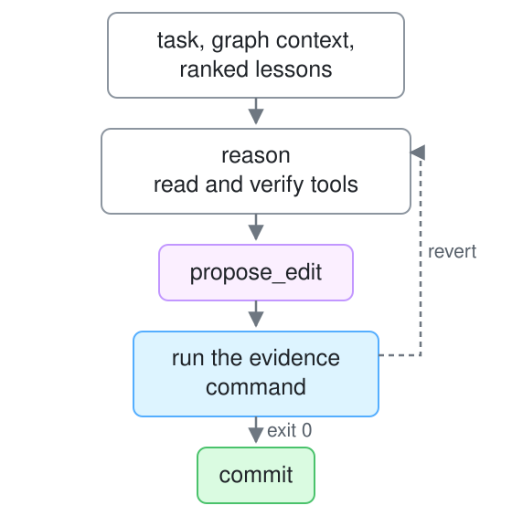
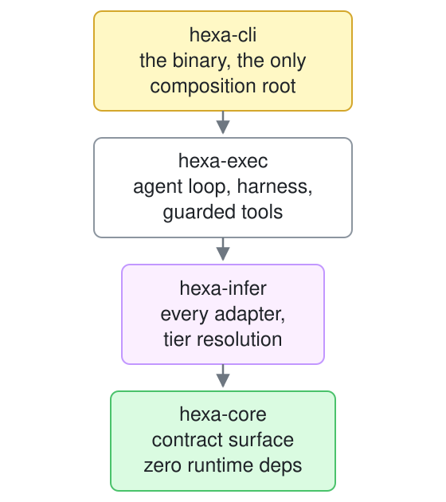

# hexa Architecture

The living map. It always describes HEAD. Decisions and their reasoning live in the
append-only [ADR ledger](docs/adrs/INDEX.md); if this file and an older document
disagree, this file wins, and the contradiction is worth an ADR.

## What hexa is

One binary that scaffolds hexagonal projects and keeps checking them. There is no
daemon, no database, and no background process. Every verb runs in-process and exits.

Two gates decide whether generated work counts:

| Gate | Asks | Fails when |
|---|---|---|
| the command | does it run? | your test command exits nonzero |
| the grade | is it the shape you asked for? | boundary analysis falls below the floor |

The first answers *does it run*. The second answers *is it the shape you asked
for*. A test suite cannot reach that second question. A program whose use case
imports a database driver passes its tests.

## The execution model

A single ReAct loop, in process. The differentiator is the quality of context
assembled for one loop, not the number of loops.

<p align="center">
  <picture>
    <source media="(prefers-color-scheme: dark)" srcset=".github/assets/diagrams/loop-dark.svg">
    
  </picture>
</p>

- **Loop and tool protocol.** `hexa-exec/src/direct_react.rs` holds the ReAct loop.
  `simple_agent.rs` holds native function-calling with a text-mode JSON fallback.
  `direct_exec.rs` holds the single-shot path.
- **The loop is given what it uses.** `ExecDeps` carries its tools, worktrees, frontier
  agent, run log and memory, each behind a port in `hexa-exec/src/ports.rs`;
  `hexa_exec::default_deps()` wires the real ones. The loop never names an adapter.
- **Curated, guarded tools.** Each is an adapter behind the `Tool` port, in
  `hexa-exec/src/tools/`, registered by `hexa_exec::default_tools()`. Read and verify tools only
  (`repo_read`, `repo_grep`, `cargo_check`, `typescript_check`, `dep_audit`,
  `secret_scan`) plus the terminal `propose_edit`. No arbitrary shell. Tools reject
  path traversal, block critical paths, and cap output.
- **Code-graph context.** `gather_context` reads `graph-out/graph.json` and calls
  `hexa_graph::context::context_for(file)` and `rank_lessons`.
- **The gate is the sole authority on what commits.** A pass that exercised nothing
  is rejected as vacuous. A failed edit reverts atomically, so the next attempt
  matches against the original file rather than a half-applied one.
- **Worktrees separate agents.** Multi-agent work is harness subagents, one
  worktree each. The `pre-agent` hook blocks a code-writing subagent whose
  Agent call lacks `isolation: "worktree"`, and `subagent-stop` names every
  worktree branch holding commits the current branch lacks, with the
  `hexa dev worktree merge` command that lands them. hexa's own isolated runs
  (`hexa bench`) use `hexa/auto/<id>` worktrees beside the repo, hard-guarded
  against committing to the operator's tree. Interactive `hexa do` commits on
  the current branch.
- **Best-of-N across complementary models.** A run walks the ordered candidate list
  in `.hexa/project.json → inference.react_models` and commits the first candidate
  whose edit passes the gate. The gate picks the winner, not a classifier, so a
  mis-route costs latency and nothing else.
- **Frontier delegation.** A `claude-code` candidate hands the whole task to the
  operator's logged-in `claude` CLI, inside the same worktree, gate and commit. No
  API key, no VRAM ceiling. The call — budget, spawn, recorded spend — is the
  `Frontier` port's; the do-loop and the adversarial harness both receive it.

## The build harness

The loop above handles *bounded* work: one file, one gate. Whole systems use
in-process fan-out of inference calls:

- **`hexa scaffold '<what>' --target <dir> --lang <l> --grade A`.** Write the
  deterministic floor, prove its gate on this machine, then build the description
  onto it. Gated on the build **and** the grade.
- **`hexa build '<challenge>' --target <dir> --gate '<cmd>'`.** Propose N divergent
  designs, red-team each, synthesize one spec, build until the gate passes. The spec
  is a disposable intermediate.
- **`hexa harden <path> --gate '<cmd>'`.** Hunt for bugs by failure-class lens,
  verify each finding skeptically (default-refute), fix the confirmed ones under the
  gate.
- `hexa build --harden` chains the last two.

What keeps it disciplined: the gate is the only authority, and the verifier defaults
to *refuting*, so plausible-but-wrong findings die before any edit is made.

## Workspace crates

Seven crates, one binary. The dependency direction is the architecture:

<p align="center">
  <picture>
    <source media="(prefers-color-scheme: dark)" srcset=".github/assets/diagrams/crates-dark.svg">
    
  </picture>
</p>

| Crate | Role |
|---|---|
| **hexa-core** | The contract surface: the inference port and its mock, message/tool/validation types, value types, and `ports::edit` — the critical-path rule every editing adapter must obey. **Zero runtime dependencies**. Nothing below can bleed a runtime concern upward. |
| **hexa-infer** | Every inference adapter (`adapters/secondary/`), behind its ports: `Backends`, `Discovery`, `EndpointRegistry`, and `LocalProvider`, the local runtime's identity. `complete.rs` is the use case; `wiring.rs` picks the adapter that serves a model. **No file outside this crate names a provider or a model.** |
| **hexa-exec** | The agent loop, per-run worktree isolation, the adversarial harness, transcript compression, the guarded tool library, the file-backed local store — the loop and harness as use cases, everything they touch behind `Tool`, `Worktrees`, `Frontier`, `RunLog`, `MemoryStore` and `Provenance`. `do_task.rs` picks the loop for a task. |
| **hexa-analysis** | Tree-sitter boundary checking (the parser behind `AstPort`), the one layer classifier and the project's layer map, cross-package import resolution, dead-export and cycle detection, the coverage ceiling, the layer inventory, rule conformance, the architecture fingerprint, six health detectors. Powers `hexa analyze`. |
| **hexa-graph** | The code knowledge graph: `context_for`, `rank_lessons`, community detection. Builds and reads `graph-out/graph.json`. Its ports hold the extraction contract. |
| **hexa-git** | Git plumbing over libgit2. |
| **hexa-cli** | The binary. Every verb is a primary adapter; it composes the crates. |

Each library crate's root (`lib.rs`) is its composition root: it wires the crate's
default adapters behind the crate's ports — `hexa_exec::default_deps()`,
`hexa_infer::wiring`, `hexa_analysis::default_ast()` — so a caller asks for a port
and never constructs an adapter.

## The loop, and the hooks that keep it

Decide (an ADR) → Gate (the command that must exit 0, written before the code)
→ Build → Harden. `hexa loop` records where a project's work stands in
`.hexa/loop.json`: the ADR, the gate and the stage. The file is committed
with the branch, so it travels with the pull request; the ADR it names is the
durable record a reviewer reads, and `hexa loop adr` refuses an ADR that is
not in `docs/adrs/`. `hexa do`, `hexa build` and `hexa harden` record their
gate as they run.

`hexa init` installs Claude Code hooks that call the binary. Each hook is one
short process that reads the harness's JSON payload; the payload's
`session_id` keys the session state in `~/.hexa/sessions/`.

| Hook | What it does |
|---|---|
| `session-start` | prints the architecture fingerprint and where the work stands |
| `route` | sizes the prompt (T1 trivial, T2 a change with a shape, T3 feature-sized); on T2 and T3 prints the loop, on T3 drafts a workplan |
| `pre-edit` | boundary check; in a T2 or T3 session with no gate recorded, stops the edit in mandatory mode and warns in advisory mode. A block prints its reason on stderr; a file outside the project is not held to the project's rules |
| `pre-bash` | stops destructive commands |
| `pre-agent` | a code-writing subagent must have `isolation: "worktree"` |
| `subagent-start`, `subagent-stop` | record the subagent; on stop, name worktree branches with unmerged commits |
| `post-edit` | runs `hexa analyze --file` on the edited file — the grade's own check, for one file |

`lifecycle_enforcement` in `.hexa/project.json` is `mandatory` (stop) or
`advisory` (warn).

## State

All of it is files on disk.

| What | Where |
|---|---|
| Lessons, gaps, decisions | `.hexa/memory.jsonl` in the project (`hexa memory`); `~/.hexa/memory.jsonl` outside one, or with `--global` |
| Where the work stands: ADR, gate, stage | `.hexa/loop.json` in the project, committed (`hexa loop`) |
| Session state, keyed by the harness session id | `~/.hexa/sessions/agent-<session_id>.json` |
| Agent and subagent run feed | `~/.hexa/agent-runs.jsonl` (`hexa do runs`) |
| Token and dollar spend, per call | `~/.hexa/inference-log.jsonl` (`hexa spend`; budget in `.hexa/project.json`) |
| Registered inference backends | `~/.hexa/inference-servers.json` (`hexa config inference`) |
| Code knowledge graph | `graph-out/graph.json` (`hexa graph build`) |
| ADRs, workplans | `docs/` |
| Project config and rules | `.hexa/project.json`, `.hexa/ADR-rules.toml` |

Files rather than a database because every reader is a short-lived process on one
machine. A cache in front of a file that only a short-lived process reads is not a
cache. It is a second source of truth that can disagree with the first.

## Tiered inference routing

A task's tier selects a model from `.hexa/project.json → inference.tier_models`.

| Tier | Use case |
|------|----------|
| T1 | scaffold / transform / script / classification |
| T2 | standard codegen |
| T2.5 | complex reasoning |
| T3 | frontier work |

The do-loop selects separately via `inference.react_models`. Choose both empirically
with **`hexa bench agentic`**. It runs fixtures through the *real* loop in an
isolated worktree and scores per-model pass rates (corpus in
`docs/benchmarks/`). External coding-leaderboard rank does not predict agentic-loop
performance: measured here, the top-leaderboard local model scored last on the grid.

## Hexagonal rules, enforced

`hexa analyze` walks the AST and checks these. hexa obeys them itself: **A+ / 100 /
0 boundary violations, 0 cycles, 149/149 files in a layer**, with every import
between its crates checked. `hexa_grades_itself_by_ratchet` fails on any new
violation.

| # | Rule |
|---|---|
| 1 | `domain/` imports only `domain/` |
| 2 | `ports/` imports `domain/` only |
| 3 | `usecases/` imports `domain/` + `ports/` only |
| 4 | adapters import `ports/` **only**, never the domain directly |
| 5 | adapters never import other adapters |
| 6 | only a composition root — a crate's `lib.rs`, or a file declared one — imports an adapter |
| 7 | relative imports in scaffolded TypeScript use `.js` extensions (NodeNext) |

**Where a file's layer comes from**, first match wins: the project's declaration in
`.hexa/project.json → analyze.layers` (a path prefix → a layer); a crate or package
named for its layer (`app-domain`, `app_ports`); the folder names above. A flat
`adapters/` folder counts as primary (ADR-2609122048). One classifier serves the
grade, `--file`, the inventory and every other report.

**What is checked:** every import, including imports between the workspace's own
packages (Cargo crates, Go modules, npm packages) and, in Rust, `super::`, inline
(`crate::x::y()`), nested and `pub use` paths. **What the grade claims:** no more
than it could see. The score is capped at the share of files that have a layer, and
A+ needs all of them (ADR-2609241707); the report names each file with none.

Rule 4 is the one implementations break. An adapter needing a domain type gets it
because the **port re-exports it**. Each adapter then has exactly one edge into
the core.

**What the grade trusts.** A composition root is exempt: that is what lets it wire
adapters, and it means anything a crate root exports is unchecked. An import that
leaves the project — `std::fs`, a process spawn, a runtime crate — is checked only
where `[[import_policy]]` in `.hexa/ADR-rules.toml` says what a layer may know
(ADR-2609211430; the gap it closed is in
[`docs/analysis/2609120100-real-io-proof.md`](docs/analysis/2609120100-real-io-proof.md)).
hexa's own rules file declares no policy, so a hexa use case that reads a file
through `std::fs` is not flagged — several in `hexa-exec` still do.

## Governance

- **ADRs are append-only.** A changed decision gets a new ADR that supersedes the
  old one. Nothing is edited or deleted. Lifecycle `Proposed → Accepted → Completed`,
  or `Rejected | Abandoned | Superseded | Deprecated`, changed only through
  `hexa adr accept|complete|supersede`.
- **Epochs** group ADRs by design era, so an old decision can be read in the context
  it was made. `hexa adr reindex` regenerates the [INDEX](docs/adrs/INDEX.md).
- **`founding-goals.md` is the one artifact agents may not author or amend.** Editing
  it requires a human commit under CODEOWNERS; retiring a goal additionally requires
  a Retirement-ADR explaining why it no longer serves the project.

## Build & test

```bash
cargo build -p hexa-cli --release
cargo test --workspace
hexa analyze .
hexa ci --standalone-gate
```
