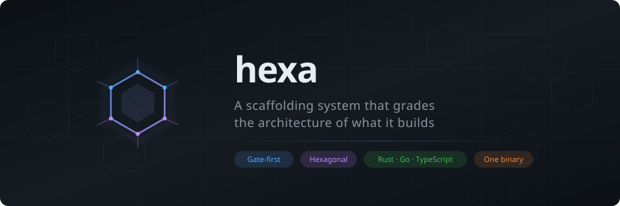
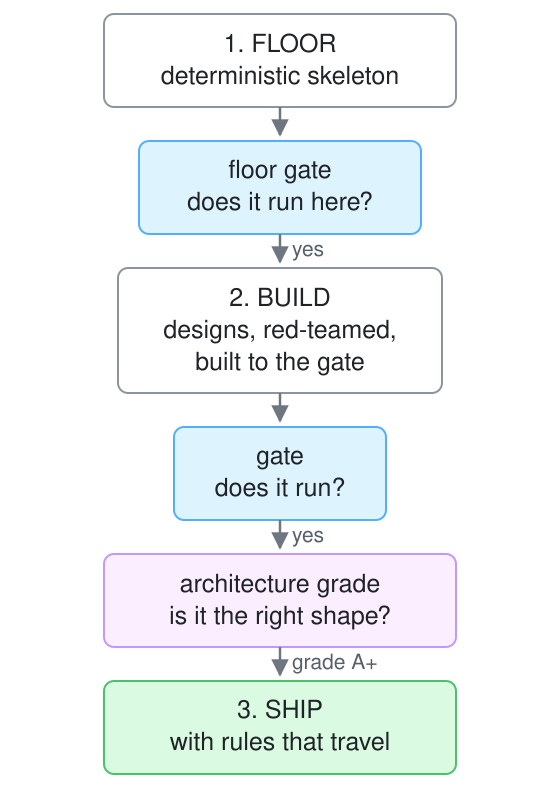
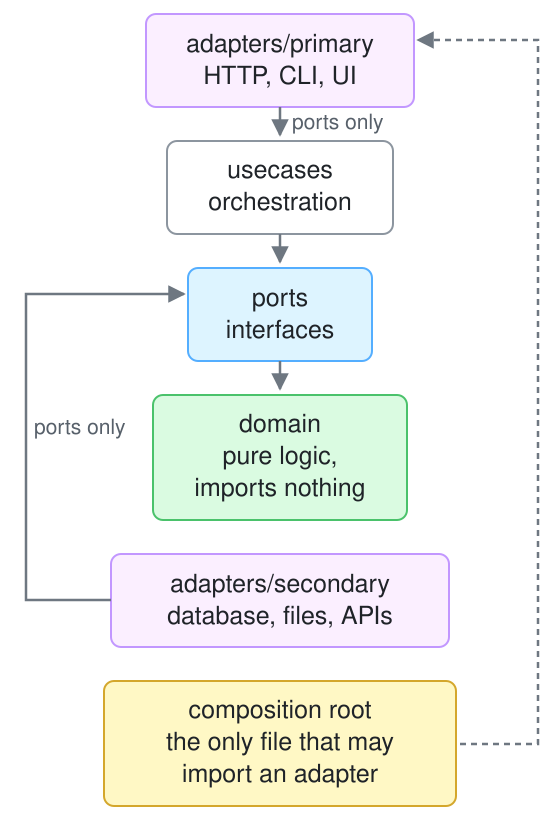

<p align="center">
  
</p>

<p align="center">
  <a href="https://www.rust-lang.org/"></a>
  <a href="LICENSE"></a>
  
  <a href="#limits"></a>
</p>

<p align="center">
  <strong>A scaffolding system that grades the architecture of what it builds.</strong><br>
  An AI writes the code. Two gates decide whether it counts:<br>
  a command that must exit 0, and an architecture grade that must hold.
</p>

<p align="center">
  <a href="#the-problem">The problem</a> &middot;
  <a href="#quick-start">Quick start</a> &middot;
  <a href="#why-hexagonal">Why hexagonal</a> &middot;
  <a href="#why-rust-go-and-typescript">Why static languages</a> &middot;
  <a href="#evidence">Evidence</a> &middot;
  <a href="#limits">Limits</a>
</p>

---

hexa is for anyone who uses an AI agent to write code and wants to know that the
result is still the system they designed. It builds projects in the
ports-and-adapters style, checks that the boundaries held, and ships in one
binary with no daemon and no database.

## The problem

Generating code stopped being the bottleneck. Checking it didn't.

An AI agent produces a working feature in minutes. It also produces features
whose tests pass and whose shape is wrong. A use case imports a database driver.
A domain type depends on an HTTP client. Nothing fails. The suite is green. The
next change is a little harder, and the one after that is harder still.

A test suite answers *does it run*. Nothing in that loop answers *is it still
the system I designed*.

### Why spec-driven development doesn't close it

The common answer is to write the spec first and have the agent implement it.
That moves the problem rather than solving it, for one structural reason:

> **A spec is prose. Prose cannot fail.**

Code drifts from a spec in silence, because nothing ever runs the spec. In one
project's spec corpus, 44 of 110 specs described features that had already been
deleted, and not one raised an error. A document that cannot fail is
indistinguishable from a document that is wrong.

| | spec-driven | gate-driven |
|---|---|---|
| The artifact | prose | a command |
| Can it fail? | **no** | yes, with an exit code |
| When code drifts | the spec silently stops being true | the gate goes red |
| What decides done | a human reading two documents | the exit code |

A gate is executable, so it fails the moment it stops being true. That is the
whole difference, and it is why hexa has no spec step.

## Quick start

```bash
curl -fsSL https://raw.githubusercontent.com/gaberger/hexa/main/install.sh | bash
hexa bootstrap                       # prerequisites, inference server, config
```

That installs one binary from the latest release; `hexa self-update` keeps
it current, and `cargo build -p hexa-cli --release` builds it from source.

**Scaffold**

```bash
# the floor alone: deterministic, runnable, carries its own rules
hexa init ./myapp --scaffold --lang rust

# the floor plus what you described, gated on the build AND the grade
hexa scaffold "A bookmark service: SQLite store, HTTP API, tag search" \
  --target ./myapp --lang rust --grade A
```

```
✓ 8 files (rust) — gate: cargo test
✓ floor gate green: cargo test
✓ 2 designs → 2 critiques → build GREEN
✓ gate re-run: PASS — 27 test(s) ran
✓ architecture grade: A+ — score 100/100 (floor A)
```

**Change one thing**

```bash
hexa do run "make add() return a + b, not a - b" \
  --file src/lib.rs --evidence "cargo test --test add"
```

hexa edits the file, runs the command, and commits **only if it exits 0**.
Otherwise the edit is reverted. A model that wanders commits nothing.

**Check the shape**

```bash
hexa analyze .                       # architecture grade + rule violations
hexa analyze . --grade A             # fail when the grade is below A
hexa graph consumers <path>          # who depends on this, before you delete it
```

**Review it**

```bash
# adversarial: hunt the target by lens, verify each finding, fix under the gate
hexa harden src/domain/merge.rs --gate "cargo test -p mycrate"

# cooperative: diverge, red-team, synthesize, build to the gate
hexa build "a bounded work queue" --target src/queue --gate "cargo test"

# either one, past any terminal or tool timeout
hexa harden src/ --gate "cargo test" --detach
```

A pass reports each phase as it runs, with elapsed time and a heartbeat, and
names which reviewer answered. If none did — a spend limit, an expired login —
it says nothing was reviewed rather than reporting a clean file.

**Stay in the loop**

```bash
hexa loop adr ADR-2609131800              # the decision, which must already exist
hexa loop gate "cargo test --test add"    # the command that must exit 0, before the code
hexa loop evidence "cargo test -- --nocapture"   # the measurement the decision rests on
hexa loop stage done                      # runs the evidence and writes it into the ADR
hexa loop                                 # where the work stands, yours and every other session's
hexa spend                                # tokens and dollars, by source and model
```

`stage done` appends the evidence command's own output to the ADR, with the
commit it ran at. The number in the decision record is the number the tree
produced. A failing evidence command appends nothing and refuses to close.

**Check the install**

```bash
hexa doctor                               # exits non-zero when a check fails
hexa go                                   # the next right thing
```

`doctor` resolves every configured tier against the backends it can actually
reach, so a tier naming a model nothing serves fails rather than printing the
config back.

With the hooks installed, a session opens by printing where the work stands,
a feature-sized edit with no recorded gate is stopped, and a code-writing
subagent must run in its own worktree.

It scaffolds Rust, Go and TypeScript. `hexa --help` lists all 27 verbs.
[Getting started](docs/GETTING-STARTED.md) has the longer version.

---

## What hexa does

There are two gates because they answer different questions.

<p align="center">
  <picture>
    <source media="(prefers-color-scheme: dark)" srcset=".github/assets/diagrams/pipeline-dark.svg">
    
  </picture>
</p>

**The floor is not generated.** It comes from templates compiled into the
binary. The output is byte-identical on every machine, every run. A scaffold
you cannot reproduce is not a foundation, it is a draft. Its gate runs *before*
any model call, because a skeleton that will not build on your machine makes
everything measured after it meaningless.

**The second gate checks the shape.** `hexa analyze` grades the boundaries, and
`hexa scaffold --grade A` fails the build when the grade is not earned.

**Rules travel with the project.** Every scaffold ships a `.hexa/ADR-rules.toml`
that `hexa analyze` runs from then on. The scaffold is not a starting point you
leave behind. It is the contract the project keeps being measured against.

**The loop is recorded, and the hooks read it.** Decide, gate, build, harden.
`hexa loop` keeps the ADR, the gate, the evidence and the stage in
`.hexa/loop.json`, one entry per session, so a reviewer of the pull request
sees which decision the work is under and which command proved it — and a
second session in the same checkout sees what the first is doing, including a
run in flight, rather than silently overwriting it. The ADR is the durable
record; the loop file points at it, and `hexa loop stage done` writes the
evidence command's output into it. `hexa do`, `hexa build` and `hexa harden`
record their gate as they run. The hooks `hexa init` installs read that
record: a session opens with it, a feature-sized prompt repeats it, and an
edit for feature-sized work with no gate recorded is stopped until the gate is
written.

---

## Why hexagonal

Because its rules are mechanically checkable. "Good separation of concerns"
cannot be graded. This can:

<p align="center">
  <picture>
    <source media="(prefers-color-scheme: dark)" srcset=".github/assets/diagrams/hexagon-dark.svg">
    
  </picture>
</p>

Every arrow points inward, and `hexa analyze` walks the AST to check it. The
rules are short enough to state and strict enough to fail:

| # | Rule |
|---|---|
| 1 | `domain/` imports only `domain/` |
| 2 | `ports/` imports `domain/` only |
| 3 | `usecases/` imports `domain/` + `ports/` only |
| 4 | adapters import `ports/` **only**, never the domain directly |
| 5 | adapters never import other adapters |
| 6 | the composition root is the only file that imports an adapter |

Rule 4 is the one implementations break. An adapter that needs a domain type
gets it because the **port re-exports it**. Every adapter then has exactly one
edge into the core, and swapping a database means touching one file.

**Why this beats a linter.** A style rule tells you a line is ugly. These tell
you a *dependency* is wrong, which is the thing that makes a codebase expensive
to change. Because it is a graph property rather than a matter of taste, a
number falls out of it. That number is what lets it be a gate instead of a
suggestion.

---

## Why Rust, Go and TypeScript

Because each has a compiler, and a compiler is a gate.

The agent loop edits a file, compiles it, reads the error, and edits again.
That loop is only as fast as the compiler and only as useful as what the
compiler catches. In a statically typed language a wrong shape fails in
seconds, at compile time, before any test runs. In a dynamic language the same
mistake waits for a test that may not exist, and the first gate the agent meets
is the one it wrote itself.

Static analysis needs the same property. `hexa analyze` walks the import graph.
That graph is only knowable when imports are explicit and resolvable at build
time. Duck typing and runtime module loading make the boundaries invisible to
any tool, which means the second gate cannot exist.

The cost is real and it is measured below. Strictness makes the gate stronger
and the task harder. Weaker models fail Rust and Go where they pass TypeScript.
That trade is the point. A gate a model cannot pass is doing its job.

---

## Evidence

Six projects, each from a single sentence, every gate re-run independently from
a clean build:

| Project | Lang | Tests | Proves |
|---|---|---:|---|
| [`linkstore-svc`](examples/linkstore-svc) | Rust | 27 | Real I/O: HTTP, SQLite, a migration, 12 end-to-end tests against a live port |
| [`game-2048-ts`](examples/game-2048-ts) | TS | 88 | The gate was broken five ways and failed each time |
| [`url-shortener-rs`](examples/url-shortener-rs) | Rust | 39 | A+ on the architecture grade |
| [`game-life-rs`](examples/game-life-rs) | Rust | 36 | Pure logic, no I/O, from one sentence |
| [`ratelimiter-proof`](examples/ratelimiter-proof) | Rust | 18 | `hexa harden` found three bugs behind fourteen passing tests |
| [`game-ttt-go`](examples/game-ttt-go) | Go | ✓ | A perfect minimax player |

**The tests were broken on purpose to prove they can fail.** Breaking the HTTP
status in `linkstore-svc` failed 4 tests. Breaking a domain rule failed 3 more.
Restoring returned 27 of 27. A passing test proves nothing until you have
watched it fail.

**The second gate held there.** With a live database and a live listener, the
shortcut is a use case reaching for the driver. It didn't:

```
src/usecases/  →  crate::domain, crate::ports, std::sync::Arc
```

**Adversarial review finds what tests miss.** `hexa harden` read a comment on the
rate limiter claiming `u128` cannot overflow on a product of two `u64`s.
`Duration::as_nanos` returns a `u128`. The product overflows, a cast truncates
it, and the result is a rate limiter that silently limits nothing. All 14 tests
passed. A spec would not have caught it either, because the intent was correct.
Only an adversary reading the code finds it.

**Repairing code it did not write.** Against a 1,685-file project, ten
single-token bugs injected into ten files: **10 of 10 repaired**, each restoring
the original line exactly, zero test files edited.

**Refactoring code it did not write.** A second project had 17 boundary
violations in a web client with no ports layer. hexa was given the rule and the
count, not the files. It found **17 of 17**, plus five more outside the target,
added a typed ports layer with the domain types re-exported through it, changed
no logic, edited no test, and kept all 177 tests green. It also wrote a
boundary test of its own, unprompted. The grade reached C rather than A. Four
points came from a detector that looks for port interfaces imported by name and
did not recognise the correct TypeScript pattern of importing the port's value.
Eighteen came from dead exports elsewhere in the project that the refactor did
not touch. The detector defect is recorded in
[`docs/analysis/2609120500-refactoring-trial.md`](docs/analysis/2609120500-refactoring-trial.md).

Every number above has a command that checks it in
[`docs/EVIDENCE.md`](docs/EVIDENCE.md).

---

## Limits

**Localisation from a failing test.** Given a rule, hexa finds every file that
breaks it. Given only a failing test name, it found the right file **once in
ten**. The first is what the analyzer is for. The second is what a bug report
looks like, and it does not work yet.

**No verb for "refactor to a grade".** The refactoring trial was driven by
`hexa build` with the analyzer as its gate. That worked, and it is not a verb.
`hexa do` takes one file. A change that needs a new directory and edits across
six files has nothing shaped for it.

**Third-party imports in `domain/`.** Rule 1 says domain imports only domain.
The analyzer checks layer-to-layer edges and does not check that, so a project
can pull a runtime into its domain and still score A+. The headline rule is
stricter than what is enforced.

**The code generation is a frontier model.** hexa contributes the deterministic
floor, the gates, the grade and the adversary. It does not do the writing. It
turns a capable model into a disciplined one. It does not replace it.

**Local models have a ceiling, and it depends on your language.** The same task,
per model, pass rate:

| Model | Rust | TS | Go |
|---|---|---|---|
| devstral-small-2:24b | 5/5 | 3/3 | 2/3 |
| gemma3:12b | 4/5 | 2/3 | 1/3 |
| qwen2.5-coder:14b | 0/5 | **2/3** | 0/3 |
| gpt-oss:20b | 0/5 | **1/3** | 0/3 |

TypeScript is forgiving. Rust and Go are strict, and weaker models fail both.
The top-of-the-leaderboard local model scored **last** on this grid, so
leaderboard rank does not predict performance in the agent loop. hexa runs each
candidate model in turn and commits the first whose edit passes the gate.
Measure your own with `hexa bench agentic`.

---

## Architecture

Eight crates, one binary, about 51k lines. hexa obeys its own rules: **A+, 100 of
100, zero boundary violations** on its own analyzer, over all eight crates —
149 files and 938 import edges. The scan size is part of the claim: the grade
once read 100 over 448 files because a git worktree was parked inside the tree
and its copies counted as callers (ADR-2609141030). The
only paths it excludes are its embedded scaffold templates, and it declares
that in `.hexa/project.json` like any other project would. The map is in
[ARCHITECTURE.md](ARCHITECTURE.md). The decisions are in the append-only
[ADR ledger](docs/adrs/INDEX.md).

---

<p align="center">
  <sub>Operating rules: <a href="CLAUDE.md">CLAUDE.md</a> &middot; Every claim on
  this page has a command in <a href="docs/EVIDENCE.md">docs/EVIDENCE.md</a>.</sub>
</p>
